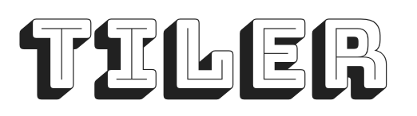

Update: See [this blog post](https://geovation.github.io/build-your-own-static-vector-tile-pipeline) which describes the approach Geovation now takes to generate vector tiles.

<br>
<br>
A no nonsense Vector Tile pipeline

The purpose of Tiler is to create an easy to use, command line orientied pipeline for taking vector data in formats such as Shapefiles, and transforming them into raw [Vector Tiles](https://www.mapbox.com/vector-tiles/) and [MBTiles](https://www.mapbox.com/help/an-open-platform/#mbtiles) files (if required).

Tiler exists as a Docker container that unifies several technologies to streamline the creation of vector tiles.


#### Setup

Setup requires installation of Docker and a few Docker commands to get started. We've provided a nice little set of instructions in the [SETUP](https://github.com/Geovation/tiler/blob/master/docs/SETUP.md) file.

#### Using Tiler

Tiler provides a selection of scripts for converting between various formats and validating them (see the tiler-scripts folder). The primary and simplest way to use Tiler however is to use a config file placed in `tiler/tiler-data/configs`. Here is an example config file which references a shapefile and a table in a PostGIS database:


```javascript
{

    "outdir" : "/tiler-data/tiles/",
    "tileset" : "states",
    "simplification" : 5,
    "validate" : false,
    "data" : {

        "states" : {
            "type" : "shapefile",
            "databaseInsert" : true,
            "paths" : ["/tiler-data/test-data/states/states.shp"],
            "minzoom" : 0,
            "maxzoom" : 5
        },

        "capitals" : {
            "type" : "postgis",
            "query" : "select * from capitals"
            "minzoom" : 2,
            "maxzoom" : 10
        }

    }

}
```

This would be saved as `tiler-data/configs/states.tiler.json`. For full documentation of the tiler config, consult the [CONFIG](https://github.com/Geovation/tiler/blob/master/docs/CONFIG.md) file in this repo. The file provides the location of the files you wish to translate, along with the output directory and if you want any simplification to occur. "data" is an object full of layers you wish to be ingested into the tiles. In this case the layer has multiple files that they use to generate that layer ("paths"). You can also provide a minimum zoom ("minzoom") and a maximum zoom ("maxzoom") for each layer.

At the moment "type" can be `shapefile` or `geojson`, `postgis` and `gml`. 

Once your config file is setup, and you have followed the setup instructions you can run:

`./run.sh states`

To generate the set of uncompressed vector tiles and an .mbtiles file.

### Tests

#### Running Tests

A set of tests are provided that can be run using [nosetest](http://nose.readthedocs.io/en/latest/). 

`./run.sh --test`

#### Vector Tile Demo

A worked example; we could run the states config file as such:

`./run.sh states`

After having ran this, there would be a set of states tiles in the `tiler/tiler-data/tiles/states` directory. You can then run a web server (i.e. python -m SimpleHTTPServer or [live-server](https://www.npmjs.com/package/live-server)) **from the host, with the tiler directory as the root**. You can then navigate to the demos folder to try out those demo pages.

Demos are provided using [Leaflet.VectorGrid](http://leaflet.github.io/Leaflet.VectorGrid/vectorgrid-api-docs.html) and also [Mapbox GL](https://www.mapbox.com/mapbox-gl-js/api/) for you to display your tiles when you're done. You will need to specify your own styling in these examples.

## Roadmap

See our contribution guide [here](https://github.com/Geovation/tiler/blob/master/docs/CONFIG.md)
Check out the roadmap [here](https://github.com/Geovation/tiler/projects/1)

## Credits

This project was made possible thanks to building on a fantastic set of previous previous software:

* [tippecanoe](https://github.com/mapbox/tippecanoe) - Mapbox 
* [ogr2ogr](http://www.gdal.org/ogr2ogr.html) - OSGeo 
* [PostGIS Docker Container](https://github.com/kartoza/docker-postgis) - Tim Sutton

## License

[MIT License](https://github.com/Geovation/tiler/blob/master/LICENSE.txt)
